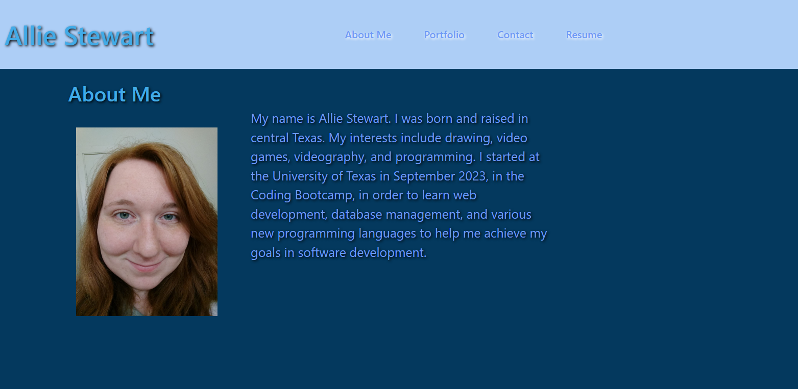
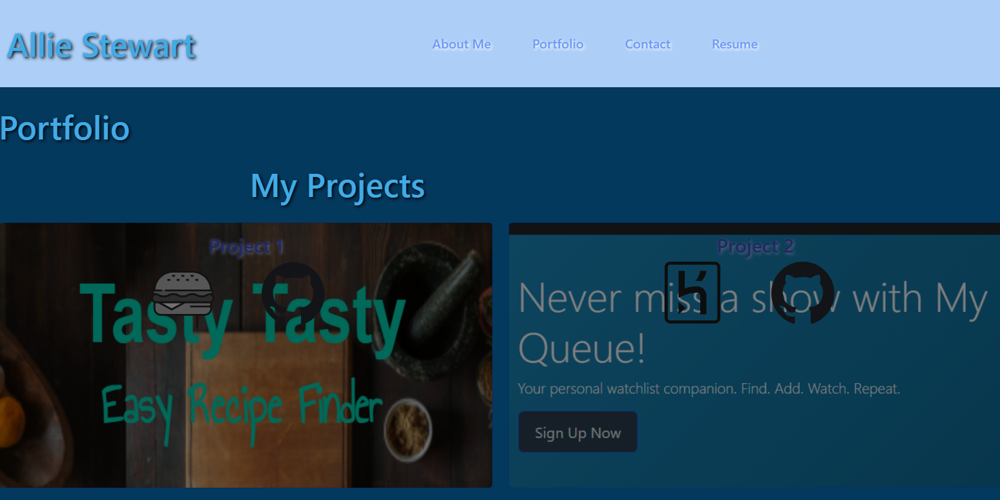
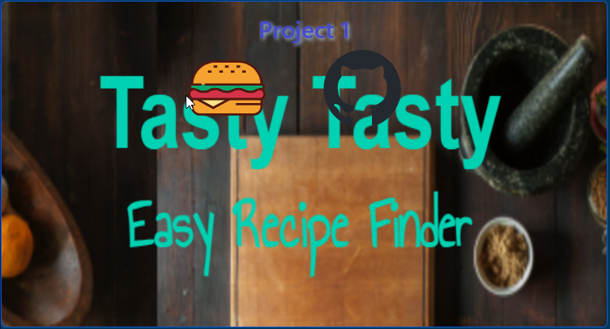
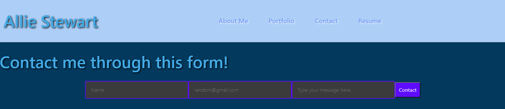
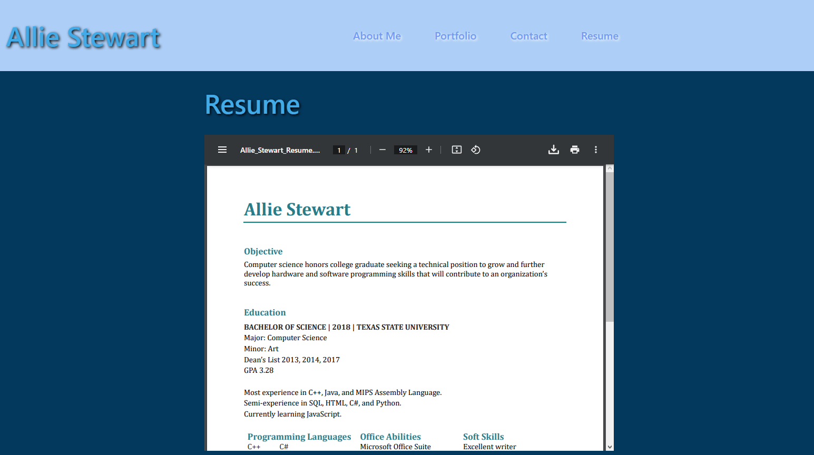

# React-Portfolio

## Badge
[]
 

## Table of Contents
- [Description](#description)
- [Screenshots](#screenshots)
- [Usage](#usage)
- [What I Have Learned](#what-i-have-learned)
- [Credits](#credits)
- [Licenses](#licenses)
 

## Description
Challenge 20 coursework for UT bootcamp. Uses React, and deployed to Netlify.  
My Portfolio made with React, using Bootstrap, CSS styling, and images screencapped  
from past projects, and from downloadable .svgs.  

## Screenshots
---Main Page, aka About Me---  

 

---Portfolio Page---  

 
Images and icons will become more vibrant when moused over.  

 

---Contact Page---  

 

---Resume Page---  

 

## Usage
Simply click on the link and watch the magic happen.    
Link to the website: https://ajsreactportfolio.netlify.app  

## What I Have Learned
I have learned the inner workings of React and how limitless it is.  
There's so many possibilities to site building that I get lost in what  
exactly to do... All I know is, I need to brush up on Bootstrap more.  

## Credits
Made by Allie Stewart.  
A lot of looking through the ol' Bootstrap docs  
at https://getbootstrap.com/docs/5.0/getting-started/introduction/  
as well as glancing over past module 20 React applications from class.  

## Licenses
Please refer to the LICENSE in the repository.  